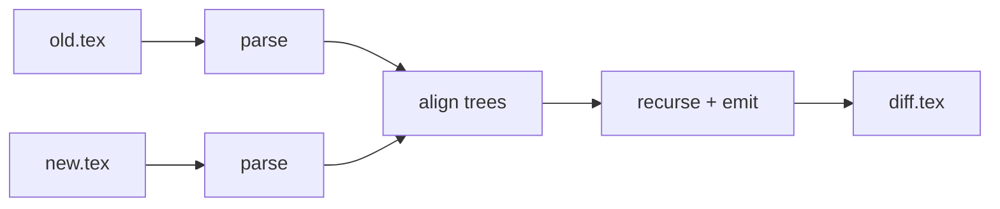

# Pipeline

The tool is a three-stage pipeline over an intermediate tree
representation:

## Stage 1: parse (`texdiff.parse`)

pylatexenc's `latexwalker` produces a concrete syntax tree; we convert it
into [`texdiff.nodes.Node`](../api.md#texdiff.nodes.Node) records. Each node
carries its exact source span in `text`, so unchanged nodes round-trip
byte-identically. Nodes are either *atomic* (math, verbatim, unknown macros,
specials — compared on exact equality, never diffed internally) or *recursable*
(text environments, groups — the aligner may recurse).

## Stage 2: align (`texdiff.align`)

`difflib.SequenceMatcher` over node *signatures* (kind + name). The edit
script consists of `Match` (identical), `Modify` (same signature, different
content → recurse), `Insert` and `Delete`. Runs of equal signature are paired
positionally, giving stable row alignment inside tables.

## Stage 3: recurse + emit (`texdiff.emit`)

Modified recursable nodes are diffed one level deeper (down to text runs,
where a word diff with semantic cleanup takes over); atomic or unmatched
nodes are rendered whole. The emitter walks the edit script and wraps
additions/deletions in `\DIFadd{...}` / `\DIFdel{...}` — latexdiff
UNDERLINE-compatible, so existing review conventions apply.

The three architecture invariants (tested in the suite):

1. **Round trip:** concatenating `Node.text` over the tree reproduces the
   input exactly.
2. **Atomicity:** a diff span never crosses a node boundary; markup never
   enters an atomic node.
3. **Compilability:** the output compiles whenever both inputs compile —
   markup is *emitted*, never repaired.
